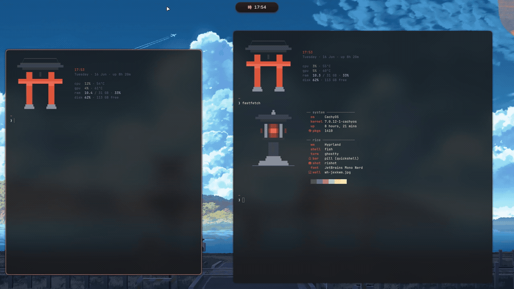
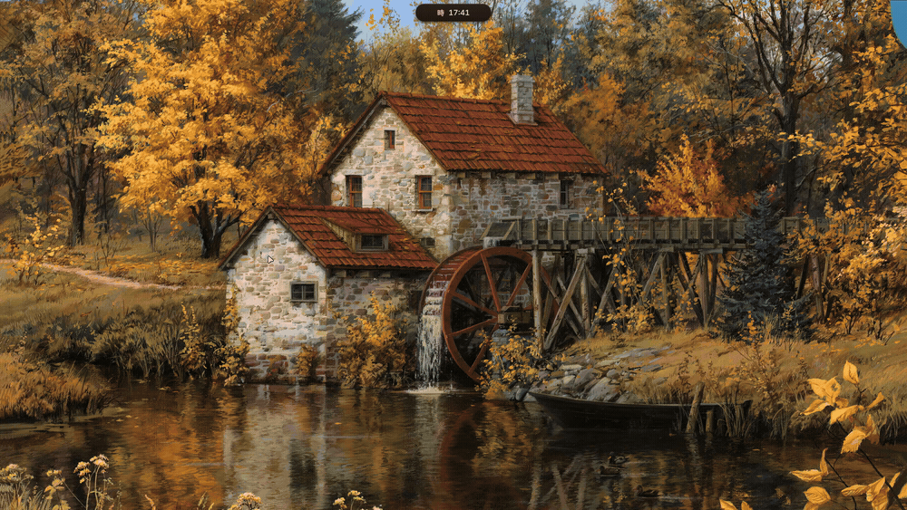

# Ricelin

**My Hyprland setup on CachyOS. The whole shell is hand-written Quickshell, no copied dotfiles.**

I started this a few months into Linux, mostly to learn how things work. It somehow turned into my daily driver.

## The shell

Everything you see is hand-written Quickshell. One pill bar that morphs into whatever surface I need.

The pill becomes media and now playing, a calendar, the wallpaper picker, clipboard history, an audio and brightness mixer, and network and bluetooth controls. There is also an app launcher, a lock screen, and rishot, my own screenshot and annotation tool.

## Stack

- WM: Hyprland, configured in Lua
- Shell UI: custom Quickshell
- Terminal: Ghostty
- Shell: fish
- Font: JetBrains Mono Nerd
- Colors: wallust, palette pulled from the wallpaper

wallust reads a palette from each wallpaper and recolors the terminal, window borders and fastfetch. The shell itself runs a warm vermilion theme I tuned by hand.

## Keybinds

| Key | Action |
|---|---|
| `Super` + `Return` | terminal |
| `Super` + `Space` | app launcher |
| `Super` + `V` | clipboard history |
| `Super` + `C` | wallpaper picker |
| `Super` + `B` | shuffle wallpaper and retheme |
| `Super` + `E` | file manager |
| `Super` + `T` | toggle floating |
| `Super` + `L` | lock |
| `Print` | rishot |

## Notes

These are my personal dotfiles, set up around my own machine. They are here to read and borrow from, not a one-command install. Paths and hardware bits will need adjusting.

## Credits

The lock screen, the SDDM background and the wallpapers are not mine. See [CREDITS](configs/sddm/themes/torii/CREDITS.md).
